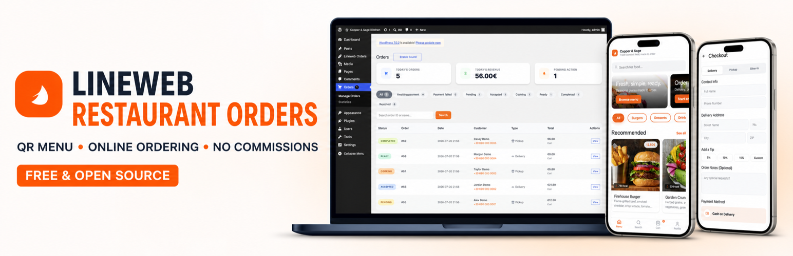
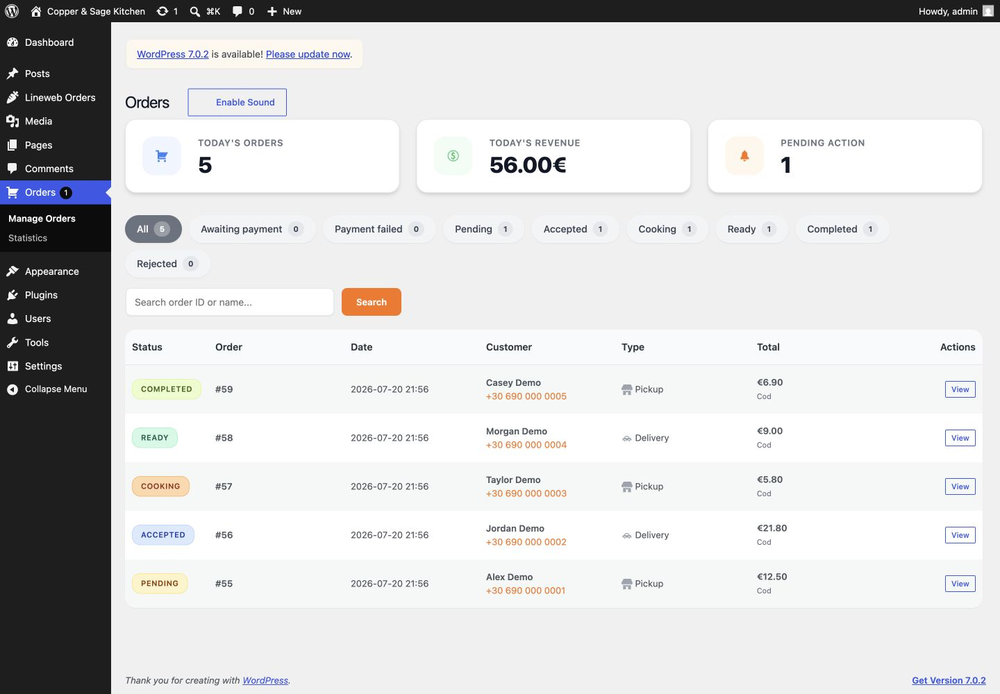
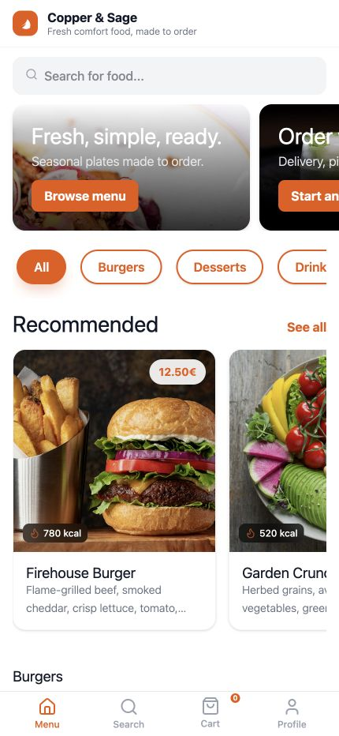
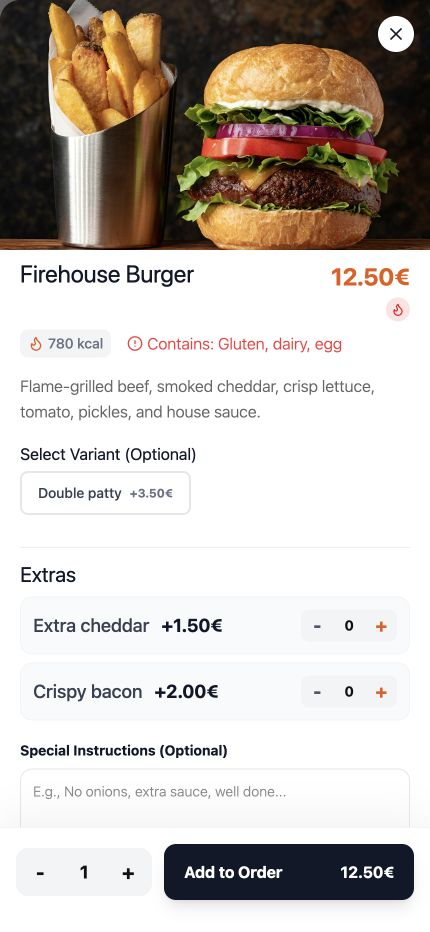
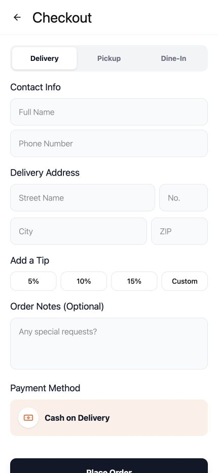
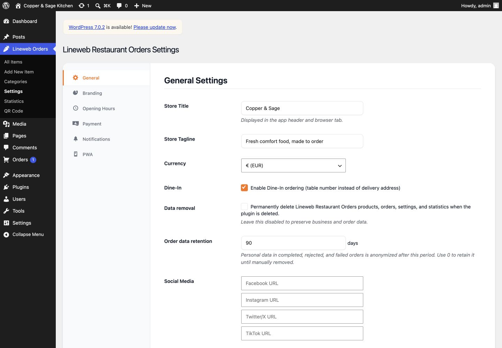
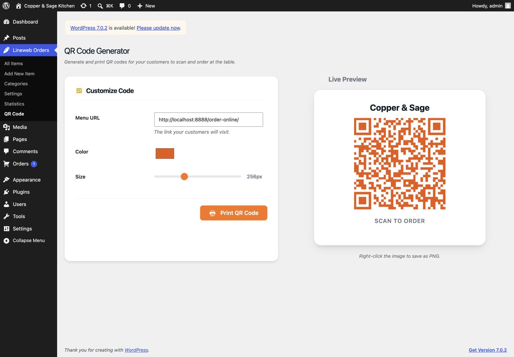

# Lineweb Restaurant Orders — QR Menu & Online Ordering for WordPress



Lineweb Restaurant Orders is a free, self-hosted QR menu and online food ordering plugin for WordPress, created by [Andrew Matia / Lineweb](https://www.lineweb.gr/). Restaurants, cafés, and takeaway businesses can accept delivery, pickup, and dine-in orders directly from their own website.

Version 1.0.2 is the current public release and preserves the complete free feature set introduced in 1.0.0. There is no Pro edition, feature gate, trial, commission, author telemetry, or upgrade prompt.

## Product preview



<table>
  <tr>
    <td width="33.33%">
      
    </td>
    <td width="33.33%">
      
    </td>
    <td width="33.33%">
      
    </td>
  </tr>
  <tr>
    <td align="center"><sub>Mobile menu, banners, categories, and recommendations</sub></td>
    <td align="center"><sub>Variants, extras, dietary details, and notes</sub></td>
    <td align="center"><sub>Delivery, pickup, dine-in, tips, and payment</sub></td>
  </tr>
</table>

<table>
  <tr>
    <td width="50%">
      
    </td>
    <td width="50%">
      
    </td>
  </tr>
  <tr>
    <td align="center"><sub>Store, privacy, payment, and notification settings</sub></td>
    <td align="center"><sub>Local QR-code generation and print preview</sub></td>
  </tr>
</table>

<sub>Screenshots use fictional local demo data. Food photography is shown under the [Unsplash License](https://unsplash.com/license) and is not bundled with the plugin.</sub>

## Included

- Food products, categories, variants, extras, dietary labels, and allergens.
- Delivery, pickup, and optional table ordering.
- Server-authoritative totals with cash and optional Stripe payments.
- Order management, tracking, receipts, QR codes, aggregate reporting, and optional PWA support.
- Optional Twilio WhatsApp notifications and configurable privacy retention.

See [`readme.txt`](readme.txt) for installation, service disclosures, privacy behavior, and the full feature list.

## Requirements

- WordPress 6.2 or newer.
- PHP 7.4 or newer.
- Node.js 20 and Composer 2 only when developing or rebuilding assets.

## Development

```bash
composer install
npm ci
npm run build
composer test
composer lint
npm run test:js:syntax
```

The isolated WordPress integration environment uses `npm run wp-env -- start`, followed by `npm run test:php`.

Build the WordPress-ready archive with:

```bash
npm run build:release
```

Development and test files remain in GitHub for review. The release builder excludes them from the installable plugin ZIP.

## Security

Please do not publish exploitable security details in a public issue. Follow [`SECURITY.md`](SECURITY.md) for responsible reporting.

## Support and custom work

Use the WordPress.org support forum for the included plugin features. For tailored integrations or restaurant-specific workflows outside the included scope, visit [www.lineweb.gr](https://www.lineweb.gr/).

## Copyright and license

Copyright 2025-2026 Andrew Matia / Lineweb. Lineweb Restaurant Orders is licensed under GPL-2.0-or-later; see [`LICENSE`](LICENSE). Third-party components retain their original copyrights and compatible licenses; see [`LICENSE.md`](LICENSE.md).
